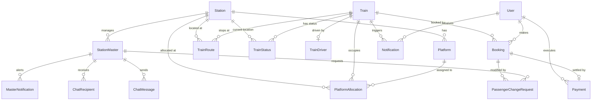

# 🚆 RailSync — System Engineering & Security Audit Report
> **Comprehensive Architectural, Database, and Security Audit**  
> *Prepared by Senior Backend & DBMS Engineering Audit*

---

## 1. PROJECT OVERVIEW

### 1.1 Plain Terms Summary
**RailSync** is an end-to-end Railway Operations Management & Passenger Booking System. It bridges passenger-facing workflows (train schedule discovery, multi-seat dynamic booking, payment transactions, visual seat maps, and live train position tracking) with railway station operations (station master dashboard, platform allocation, train driver run-state dispatching, dynamic delay propagation, AI-assisted platform conflict resolution via Anthropic Claude/Google Gemini, and inter-station communication).

### 1.2 Tech Stack
* **Language & Runtime:** Python 3.10+
* **Backend Web Framework:** Flask 3.0.3 (Modular Blueprint Architecture)
* **Real-Time Communication:** Flask-SocketIO 5.3.6 (Engine.IO / Eventlet WSGI)
* **Database Engine:** MySQL 8.0+ / TiDB Serverless (Relational DBMS)
* **ORM & Database Driver:** Flask-SQLAlchemy 3.1.1 (SQLAlchemy 2.x) with PyMySQL 1.1.1
* **Authentication & Security:** Flask-Login 0.6.3, Flask-Bcrypt 1.0.1
* **AI Integration:** Anthropic API (Claude 3.5 Sonnet / Claude 4) & Google Gemini REST API
* **Email Dispatch:** Python `smtplib` (SSL SMTP over port 465)
* **Frontend:** Jinja2 Server-Side Templates, Vanilla JavaScript (ES6+), Vanilla CSS (Custom Design System, Glassmorphism, Dark Mode), Leaflet / OpenStreetMap GeoJSON maps.

### 1.3 System Architecture
RailSync follows a modified **Model-View-Controller (MVC)** design pattern with dedicated **Service** and **Background Task** layers:

```mermaid
graph TD
    Client["Client (Browser / Mobile)"] -->|HTTP / HTTPS| FlaskApp["Flask Web Server (Gunicorn / Eventlet)"]
    Client <-->|WebSocket (Socket.IO)| SocketIO["Flask-SocketIO Layer"]

    subgraph Controllers ["Controllers (Blueprints)"]
        AuthBP["routes/auth.py (Auth, OTP, Reset)"]
        UserBP["routes/user.py (Search, Book, Track)"]
        AdminBP["routes/admin.py (Station Master & HQ)"]
        DriverBP["routes/driver.py (Driver Dispatch)"]
        ApiBP["routes/api.py (REST Polling Endpoints)"]
    end

    subgraph ServiceLayer ["Service & Worker Layer"]
        TrainService["services/train_service.py"]
        EmailService["services/email_service.py"]
        BgWorker["app.py: train_progress_task (10s Cycle)"]
    end

    subgraph ExternalServices ["External Cloud APIs"]
        ClaudeAI["Anthropic Claude API (Delay / Platform AI)"]
        GeminiAPI["Google Gemini API (Geo-coordinate Fallback)"]
        OSM["OpenStreetMap Nominatim API"]
        SMTP["Gmail SMTP Server"]
    end

    subgraph StorageLayer ["Storage Layer"]
        Models["models.py (SQLAlchemy 2.x ORM)"]
        MySQLDB[("MySQL / TiDB Database")]
    end

    FlaskApp --> AuthBP & UserBP & AdminBP & DriverBP & ApiBP
    AuthBP & UserBP & AdminBP --> ServiceLayer
    AdminBP --> ClaudeAI & GeminiAPI & OSM
    AuthBP --> EmailService --> SMTP
    ServiceLayer --> Models
    BgWorker --> Models
    Models <--> MySQLDB
```

---

## 2. DATABASE SCHEMA & ARCHITECTURAL AUDIT

The relational schema is defined in [models.py](models.py) comprising **16 distinct entities** with referential integrity constraints, primary keys, cascading foreign keys, and unique indexes.

### 2.1 Entity Relationship Diagram



---

### 2.2 Table Definitions & Schema Attributes

| Table Name | Column | Data Type | Nullable | Key / Constraints | Description |
| :--- | :--- | :--- | :--- | :--- | :--- |
| **`User`** | `user_id` | `INTEGER` | No | `PRIMARY KEY, AUTO_INCREMENT` | Passenger unique identifier |
| | `name` | `VARCHAR(100)` | No | | Passenger full name |
| | `email` | `VARCHAR(150)` | No | `UNIQUE` | Unique email for authentication |
| | `phone` | `VARCHAR(15)` | No | | Phone number |
| | `password_hash` | `VARCHAR(255)` | No | | Bcrypt password hash |
| | `created_at` | `DATETIME` | Yes | `DEFAULT CURRENT_TIMESTAMP` | Account registration timestamp |
| **`Station`** | `station_id` | `INTEGER` | No | `PRIMARY KEY, AUTO_INCREMENT` | Station unique identifier |
| | `station_name` | `VARCHAR(150)` | No | | Name of railway station |
| | `city` | `VARCHAR(100)` | No | | Station city |
| | `state` | `VARCHAR(100)` | No | | Station state |
| | `is_junction` | `BOOLEAN` | Yes | `DEFAULT 0` | Junction flag for route calculations |
| | `latitude` | `FLOAT` | Yes | | Geolocation latitude |
| | `longitude` | `FLOAT` | Yes | | Geolocation longitude |
| **`StationMaster`** | `master_id` | `INTEGER` | No | `PRIMARY KEY, AUTO_INCREMENT` | Admin / Master unique identifier |
| | `name` | `VARCHAR(100)` | No | | Admin full name |
| | `email` | `VARCHAR(150)` | No | `UNIQUE` | Admin login email |
| | `phone` | `VARCHAR(15)` | No | | Admin phone |
| | `password_hash` | `VARCHAR(255)` | No | | Bcrypt password hash |
| | `station_id` | `INTEGER` | No | `FK -> Station.station_id ON DELETE CASCADE` | Assigned station (or HQ/pool station) |
| | `is_super_admin` | `BOOLEAN` | Yes | `DEFAULT 0` | HQ Super Admin privileges flag |
| | `is_on_leave` | `BOOLEAN` | Yes | `DEFAULT 0` | Station Master leave status |
| **`TrainDriver`** | `driver_id` | `INTEGER` | No | `PRIMARY KEY, AUTO_INCREMENT` | Driver identifier |
| | `name` | `VARCHAR(100)` | No | | Driver name |
| | `email` | `VARCHAR(150)` | No | `UNIQUE` | Driver login email |
| | `password_hash` | `VARCHAR(255)` | No | | Bcrypt password hash |
| | `train_id` | `INTEGER` | No | `FK -> Train.train_id ON DELETE CASCADE` | Assigned train |
| **`Train`** | `train_id` | `INTEGER` | No | `PRIMARY KEY, AUTO_INCREMENT` | Train identifier |
| | `train_number` | `VARCHAR(10)` | No | `UNIQUE` | Unique train service code (e.g. `12951`) |
| | `train_name` | `VARCHAR(150)` | No | | Display name of train |
| | `total_seats` | `INTEGER` | No | | Maximum seat capacity |
| | `turnaround_minutes` | `INTEGER` | Yes | `DEFAULT 360` | Turnaround time at destination |
| | `anim_speed_scale` | `FLOAT` | Yes | `DEFAULT 8.0` | Simulation animation scale |
| | `service_start_date` | `DATETIME` | Yes | | Date and time when the service cycle begins |
| | `return_wait_days` | `INTEGER` | Yes | `DEFAULT 0` | Days to hold train before return journey |
| | `return_wait_hours` | `INTEGER` | Yes | `DEFAULT 0` | Hours to hold train before return journey |
| | `cycle_enabled` | `BOOLEAN` | Yes | `DEFAULT 0` | Continuous forward/reverse loop switch |
| **`Platform`** | `platform_id` | `INTEGER` | No | `PRIMARY KEY, AUTO_INCREMENT` | Physical platform identifier |
| | `station_id` | `INTEGER` | No | `FK -> Station.station_id ON DELETE CASCADE` | Station parent |
| | `platform_number` | `VARCHAR(10)` | No | | Platform label (e.g. `1`, `2`, `3A`) |
| | `is_available` | `BOOLEAN` | Yes | `DEFAULT 1` | Operational availability |
| | *Constraint* | | | `UNIQUE(station_id, platform_number)` | Prevents duplicate platform labels per station |
| **`TrainRoute`** | `route_id` | `INTEGER` | No | `PRIMARY KEY, AUTO_INCREMENT` | Route stop sequence entry |
| | `train_id` | `INTEGER` | No | `FK -> Train.train_id ON DELETE CASCADE` | Associated train |
| | `station_id` | `INTEGER` | No | `FK -> Station.station_id ON DELETE CASCADE` | Scheduled stop station |
| | `arrival_time` | `TIME` | Yes | | Scheduled arrival |
| | `departure_time` | `TIME` | Yes | | Scheduled departure |
| | `stop_number` | `INTEGER` | No | | Sequence order (1 = Origin, 2 = Stop 2, etc.) |
| | `distance_km` | `FLOAT` | Yes | | Distance from preceding stop |
| | `estimated_travel_min` | `INTEGER` | Yes | | Travel duration in minutes from preceding stop |
| | *Constraint* | | | `UNIQUE(train_id, stop_number)` | Prevents stop sequence collisions |
| **`TrainStatus`** | `status_id` | `INTEGER` | No | `PRIMARY KEY, AUTO_INCREMENT` | Live operational status |
| | `train_id` | `INTEGER` | No | `FK -> Train.train_id ON DELETE CASCADE` | Associated train |
| | `current_station_id` | `INTEGER` | No | `FK -> Station.station_id ON DELETE CASCADE` | Current station position |
| | `expected_arrival` | `DATETIME` | Yes | | Projected arrival timestamp |
| | `expected_departure` | `DATETIME` | Yes | | Projected departure timestamp |
| | `delay_minutes` | `INTEGER` | Yes | `DEFAULT 0` | Current accumulated delay |
| | `last_updated` | `DATETIME` | Yes | `ON UPDATE CURRENT_TIMESTAMP` | Last telemetry update timestamp |
| | `journey_start_datetime` | `DATETIME` | Yes | | Timestamp when run cycle departed origin |
| | `journey_direction` | `VARCHAR(10)` | Yes | `DEFAULT 'idle'` | `'forward'`, `'reverse'`, or `'idle'` |
| | `state` | `VARCHAR(20)` | Yes | `DEFAULT 'stopped'` | `'stopped'` or `'en_route'` |
| | `current_departure_time` | `DATETIME` | Yes | | Timestamp when train departed current station |
| **`Booking`** | `booking_id` | `INTEGER` | No | `PRIMARY KEY, AUTO_INCREMENT` | Passenger ticket booking |
| | `user_id` | `INTEGER` | No | `FK -> User.user_id` | Passenger |
| | `train_id` | `INTEGER` | No | `FK -> Train.train_id` | Train booked |
| | `source_station_id` | `INTEGER` | No | `FK -> Station.station_id` | Origin station |
| | `destination_station_id` | `INTEGER` | No | `FK -> Station.station_id` | Destination station |
| | `booking_date` | `DATETIME` | Yes | `DEFAULT CURRENT_TIMESTAMP` | Transaction creation timestamp |
| | `journey_date` | `DATE` | No | | Date of travel |
| | `seat_number` | `VARCHAR(100)` | Yes | | Assigned seat(s) (e.g. `1A, 1B`) |
| | `status` | `ENUM` | Yes | `('CONFIRMED', 'WAITLISTED', 'CANCELLED')` | Ticket lifecycle state |
| | *Constraint* | | | `UNIQUE(train_id, journey_date, seat_number)` | Seat collision prevention index |
| **`Payment`** | `payment_id` | `INTEGER` | No | `PRIMARY KEY, AUTO_INCREMENT` | Financial transaction record |
| | `booking_id` | `INTEGER` | No | `FK -> Booking.booking_id` | Linked booking record |
| | `user_id` | `INTEGER` | No | `FK -> User.user_id` | Payer |
| | `amount` | `DECIMAL(10,2)` | No | | Amount in INR |
| | `payment_method` | `ENUM` | No | `('UPI', 'CARD', 'NETBANKING', 'WALLET', 'CASH')` | Payment mode |
| | `transaction_id` | `VARCHAR(100)` | Yes | `UNIQUE` | Payment gateway transaction reference |
| | `payment_status` | `ENUM` | Yes | `('PENDING', 'SUCCESS', 'FAILED', 'REFUNDED')` | Transaction lifecycle status |
| | `payment_date` | `DATETIME` | Yes | `DEFAULT CURRENT_TIMESTAMP` | Execution timestamp |
| **`PlatformAllocation`** | `allocation_id` | `INTEGER` | No | `PRIMARY KEY, AUTO_INCREMENT` | Station platform berth assignment |
| | `train_id` | `INTEGER` | No | `FK -> Train.train_id ON DELETE CASCADE` | Assigned train |
| | `station_id` | `INTEGER` | No | `FK -> Station.station_id ON DELETE CASCADE` | Assigned station |
| | `platform_id` | `INTEGER` | No | `FK -> Platform.platform_id ON DELETE CASCADE` | Assigned platform |
| | `arrival_time` | `DATETIME` | No | | Berth occupancy start |
| | `departure_time` | `DATETIME` | No | | Berth occupancy release |
| **`Notification`** | `notification_id` | `INTEGER` | No | `PRIMARY KEY, AUTO_INCREMENT` | Passenger alert message |
| | `user_id` | `INTEGER` | No | `FK -> User.user_id ON DELETE CASCADE` | Target passenger |
| | `train_id` | `INTEGER` | Yes | `FK -> Train.train_id ON DELETE CASCADE` | Optional context train |
| | `message` | `TEXT` | No | | Notification message text |
| | `notif_type` | `VARCHAR(30)` | Yes | `DEFAULT 'general'` | Category (`general`, `delay`, `change_request`) |
| | `extra_id` | `INTEGER` | Yes | | Related foreign ID (e.g. change request ID) |
| | `created_at` | `DATETIME` | Yes | `DEFAULT CURRENT_TIMESTAMP` | Dispatch timestamp |
| | `is_read` | `BOOLEAN` | Yes | `DEFAULT 0` | Read receipt |
| **`PassengerChangeRequest`** | `request_id` | `INTEGER` | No | `PRIMARY KEY, AUTO_INCREMENT` | Master-initiated booking modification |
| | `booking_id` | `INTEGER` | No | `FK -> Booking.booking_id ON DELETE CASCADE` | Linked ticket |
| | `admin_master_id` | `INTEGER` | No | `FK -> StationMaster.master_id` | Initiating station master |
| | `admin_station_id` | `INTEGER` | No | `FK -> Station.station_id` | Station where request originated |
| | `field_changed` | `VARCHAR(50)` | No | | Modified field (`journey_date`, `seat_number`, `status`) |
| | `old_value` | `VARCHAR(255)` | Yes | | Previous state value |
| | `new_value` | `VARCHAR(255)` | No | | Proposed state value |
| | `reason` | `TEXT` | Yes | | Justification string |
| | `status` | `ENUM` | Yes | `('PENDING', 'APPROVED', 'REJECTED')` | Passenger response status |
| | `notification_id` | `INTEGER` | Yes | `FK -> Notification.notification_id` | Associated notification |
| | `created_at` | `DATETIME` | Yes | `DEFAULT CURRENT_TIMESTAMP` | Request timestamp |
| | `responded_at` | `DATETIME` | Yes | | Approval / rejection timestamp |
| **`ChatMessage`** | `message_id` | `INTEGER` | No | `PRIMARY KEY, AUTO_INCREMENT` | Internal administrative chat message |
| | `sender_id` | `INTEGER` | No | `FK -> StationMaster.master_id ON DELETE CASCADE` | Originating Station Master |
| | `body` | `TEXT` | No | | Message payload |
| | `is_broadcast` | `BOOLEAN` | Yes | `DEFAULT 0` | HQ network-wide broadcast flag |
| | `created_at` | `DATETIME` | Yes | `DEFAULT CURRENT_TIMESTAMP` | Transmission timestamp |
| **`ChatRecipient`** | `id` | `INTEGER` | No | `PRIMARY KEY, AUTO_INCREMENT` | Chat recipient join record |
| | `message_id` | `INTEGER` | No | `FK -> ChatMessage.message_id ON DELETE CASCADE` | Linked message |
| | `recipient_id` | `INTEGER` | No | `FK -> StationMaster.master_id ON DELETE CASCADE` | Receiving station master |
| | `is_read` | `BOOLEAN` | Yes | `DEFAULT 0` | Receipt flag |
| | *Constraint* | | | `UNIQUE(message_id, recipient_id)` | Delivery tracking index |
| **`MasterNotification`** | `notif_id` | `INTEGER` | No | `PRIMARY KEY, AUTO_INCREMENT` | Administrative station alert |
| | `recipient_id` | `INTEGER` | No | `FK -> StationMaster.master_id ON DELETE CASCADE` | Receiving admin |
| | `sender_id` | `INTEGER` | Yes | `FK -> StationMaster.master_id ON DELETE CASCADE` | Sending admin |
| | `subject` | `VARCHAR(200)` | No | | Subject header |
| | `body` | `TEXT` | No | | Body content |
| | `notif_type` | `VARCHAR(30)` | Yes | `DEFAULT 'general'` | Alert category (`delay_alert`, `general`, `system`) |
| | `is_read` | `BOOLEAN` | Yes | `DEFAULT 0` | Read receipt |
| | `created_at` | `DATETIME` | Yes | `DEFAULT CURRENT_TIMESTAMP` | Timestamp |

---

## 3. SETUP & RUN INSTRUCTIONS

### 3.1 Dependencies
Install via `pip install -r requirements.txt`:
* `flask==3.0.3`
* `flask-sqlalchemy==3.1.1`
* `flask-login==0.6.3`
* `flask-bcrypt==1.0.1`
* `flask-socketio==5.3.6`
* `flask-compress==1.15`
* `pymysql==1.1.1`
* `anthropic==0.28.0`
* `python-dotenv==1.0.1`
* `eventlet==0.36.1`
* `gunicorn==22.0.0`

### 3.2 Required Environment Variables
Create a local `.env` file in the root directory and define the following keys (do not commit actual values to source control):

```env
SECRET_KEY=                  # Cryptographic session signing key
DATABASE_URL=                # SQLAlchemy URI: mysql+pymysql://<user>:<password>@<host>:<port>/<dbname>
GEMINI_API_KEY=              # Google Gemini API key for station coordinate lookup
GEMINI_MODEL=                # Gemini model identifier (e.g. gemini-2.0-flash)
ANTHROPIC_API_KEY=           # Anthropic Claude API key for AI platform reallocation
CLAUDE_MODEL=                # Claude model identifier (e.g. claude-sonnet-4-20250514)
MAIL_USERNAME=               # Gmail SMTP username for OTP dispatch
MAIL_PASSWORD=               # Gmail App Password (16 characters)
PORT=                        # Optional port override (default: 5000)
```

### 3.3 Local Setup Steps

1. **Clone repository & enter directory:**
   ```powershell
   git clone https://github.com/Rudresh242006/RailSync.git
   cd RailSync/railsync
   ```

2. **Initialize Python Virtual Environment:**
   ```powershell
   python -m venv venv
   .\venv\Scripts\Activate.ps1
   ```

3. **Install Requirements:**
   ```powershell
   pip install -r requirements.txt
   ```

4. **Initialize Database Schema:**
   Import `database_dump.sql` into MySQL / TiDB:
   ```bash
   mysql -u <user> -p <database_name> < database_dump.sql
   ```

5. **Start Development Server:**
   ```powershell
   python app.py
   ```
   Open `http://localhost:5000` in your web browser.

---

## 4. FILE STRUCTURE AUDIT

```
railsync/
├── .env                                # Local environment secrets (must NOT be committed)
├── .gitignore                          # Git exclusions file
├── database_dump.sql                   # Full database schema and seed data dump
├── requirements.txt                    # Project dependency specification
├── extensions.py                       # Instantiation of db, bcrypt, login_manager, socketio
├── app.py                              # App factory, blueprints registration, SocketIO, background tasks
├── models.py                           # 16 SQLAlchemy DB Model classes & relationship mappings
│
├── routes/                             # HTTP & WebSocket Controller Endpoints
│   ├── __init__.py                     # Package marker
│   ├── auth.py                         # Login, Register, 6-digit OTP verification, Password Reset, Logout
│   ├── user.py                         # Passenger search, booking, payment, tracking, change requests
│   ├── admin.py                        # Station Master & Super Admin operations, Claude AI delays, maps
│   ├── driver.py                       # Train Driver dashboard, route details, station arrival API
│   └── api.py                          # REST API for train polling, seat matrix, notifications
│
├── services/                           # Business Logic & External API Integrations
│   ├── train_service.py                # Algorithmic platform scheduler & automated passenger alerts
│   └── email_service.py                # Cryptographic OTP generation & HTML SMTP email dispatcher
│
├── static/                             # Client-Side Assets
│   ├── india.geojson                   # High-resolution boundary GeoJSON for interactive map
│   └── india_simple.geojson            # Lightweight optimized boundary GeoJSON
│
├── templates/                          # Jinja2 HTML Layouts & Views
│   ├── base.html                       # Global app shell, dark theme CSS, topbar, sidebar, SocketIO listener
│   ├── index.html                      # Landing page with interactive hero & live network stats
│   ├── login.html                      # Passenger authentication portal
│   ├── master_login.html               # Staff authentication portal (Station Master / Super Admin / Driver)
│   ├── register.html                   # Passenger account creation
│   ├── verify_otp.html                 # 6-Digit Email OTP confirmation view
│   ├── forgot_password.html            # 3-Step OTP-based account recovery view
│   ├── admin/                          # Station Master & Operations Templates
│   │   ├── dashboard.html              # Live station master platform board & train monitor
│   │   ├── trains.html                 # Station-filtered train inventory
│   │   ├── add_train.html              # Dynamic multi-stop route creator with automatic distance calculation
│   │   ├── delay.html                  # Delay reporting interface & Claude AI platform allocation panel
│   │   ├── platforms.html              # Platform status manager & berth allocation board
│   │   ├── my_passengers.html          # Station passenger management & change request dispatch
│   │   ├── chat.html                   # Real-time WebSocket chat between Station Masters and Super Admin
│   │   └── super/                      # HQ Super Admin Management Views
│   │       ├── dashboard.html          # Network-wide metrics & quick dispatch hub
│   │       ├── live_status.html        # Interactive network map & live train movement tracking
│   │       ├── stations.html           # Station registry & geographical coordinates editor
│   │       ├── masters.html            # Staff directory (Active, Temp Pool, HQ Super Admins)
│   │       ├── add_master.html         # Provision new Station Master account
│   │       ├── add_temp_master.html    # Add unassigned staff to temporary relief pool
│   │       ├── edit_master.html        # Modify staff station assignment & permissions
│   │       ├── drivers.html            # Driver registry & train assignment
│   │       ├── passengers.html         # Central passenger registry & booking history
│   │       ├── history.html            # Operational log archive (delayed trains, cancelled tickets)
│   │       ├── analytics.html          # System performance analytics
│   │       └── edit_train_stops.html   # Stop-by-stop train itinerary editor
│   ├── user/                           # Passenger Experience Views
│   │   ├── dashboard.html              # Passenger home, upcoming trips, quick actions
│   │   ├── search.html                 # Route search with dynamic fare calculation & seat availability
│   │   ├── bookings.html               # Ticket booking history with instant cancellation & refund
│   │   ├── payment.html                # Payment simulation gateway (UPI, Card, Netbanking)
│   │   ├── track.html                  # Real-time train tracking timeline & platform indicator
│   │   ├── seat_map.html               # Visual interactive seat map grid
│   │   └── notifications.html          # Notification center with interactive change request approvals
│   └── driver/                         # Train Driver Views
│       ├── dashboard.html              # Driver in-cab dashboard, speed, upcoming stops, Arrive button
│       └── login.html                  # Dedicated driver portal view (redundant with master_login)
│
├── add_platforms.py                    # Standalone utility script: seed 3 platforms per station
├── alter_db.py                         # Standalone utility script: modify Booking.seat_number column
├── fix_train_states.py                 # Standalone utility script: reconcile corrupted TrainStatus states
├── migrate.py                          # Standalone migration script: add is_on_leave column & Temp Pool
├── migrate_v2.py                       # Standalone migration script: add lat/lon & journey scheduling fields
└── seed_drivers.py                     # Standalone seeding script: generate TrainDriver accounts & passwords
```

---

### 4.1 Candidates for Cleanup (Dead / Redundant Files)

| File / Directory Path | Reason for Flagging | Recommended Action |
| :--- | :--- | :--- |
| **`{templates,static/`** | Malformed directory created by a shell command syntax error on Windows (`mkdir -p {templates,static...}`). Empty subdirectories inside. | **Delete immediately.** |
| **`alter_db.py`** | One-off manual DDL script to alter `Booking.seat_number`. Already reflected in `database_dump.sql` and `models.py`. | **Delete or move to `scripts/archive/`.** |
| **`migrate.py`** | Ad-hoc migration script for `is_on_leave`. Superseded by `models.py`. | **Consolidate into `scripts/` or delete.** |
| **`migrate_v2.py`** | Ad-hoc migration script for coordinates. Superseded by `models.py`. | **Consolidate into `scripts/` or delete.** |
| **`add_platforms.py`** | Ad-hoc platform populator. | **Move to `scripts/seed_platforms.py`.** |
| **`fix_train_states.py`** | Debugging script to patch inconsistent train status records. | **Move to `scripts/fix_states.py`.** |
| **`seed_drivers.py`** | Ad-hoc driver seeder script with hardcoded password. | **Move to `scripts/seed_drivers.py` and parameterize.** |
| **`templates/driver/login.html`** | Unused template; driver authentication is handled centrally inside `templates/master_login.html`. | **Delete or redirect.** |
| **`database_dump.sql` (in root)** | Contains sensitive data and user hashes right in project root. | **Move to `db/` and verify `.gitignore`.** |

---

## 5. BRUTALLY HONEST SECURITY AUDIT

### 5.1 Hardcoded Credentials & Secrets Exposure

> [!CAUTION]
> Hardcoded credentials and plain password references were detected in source files.

1. **Hardcoded Default Password in Seeder:**
   * **Location:** [seed_drivers.py:L22](seed_drivers.py#L22)
   * **Issue:** Hardcoded plaintext password `'12345678@'` is generated and hashed for every driver in the system.
2. **Hardcoded Example Hash in Documentation:**
   * **Location:** [README.md:L109](README.md#L109)
   * **Issue:** Contains a real bcrypt hash (`$2b$12$EixZaYVK...`) for password `'secret'`.
3. **Database Dump in Version Control Directory:**
   * **Location:** [database_dump.sql:L225-L545](database_dump.sql)
   * **Issue:** Contains 27 live StationMaster accounts, 12 driver accounts, 10 user accounts, active phone numbers, and real Bcrypt hashes directly in the workspace root.

---

### 5.2 SQL Injection & Query Construction Analysis
* **Status:** **PASS / LOW RISK**
* **Finding:** The primary codebase leverages the SQLAlchemy ORM (`.filter()`, `.filter_by()`, `.get()`, `.all()`) which automatically parameterizes all SQL queries via PyMySQL prepared statements.
* **Minor DDL Flaw:** In [migrate_v2.py:L25](migrate_v2.py#L25), `conn.execute(db.text(f"ALTER TABLE `{table}` ADD COLUMN `{col}` {typ}"))` uses raw python f-string interpolation. While this is an internal offline migration script, dynamic string concatenation in DDL statements is an anti-pattern.

---

### 5.3 Missing CSRF (Cross-Site Request Forgery) Protection

> [!WARNING]
> **CRITICAL SECURITY RISK**: The entire application has **ZERO CSRF protection**.

* **Finding:** Flask-WTF / `CSRFProtect` is neither installed nor imported in [app.py](app.py).
* **Impact:** Every single state-changing POST endpoint across passenger and admin portals is vulnerable to CSRF attacks:
  * `/book` (User ticket purchases)
  * `/cancel/<id>` (Unauthorized cancellation of tickets by malicious third-party links)
  * `/payment/process/<id>` (Falsification of payment status)
  * `/delay/report/<id>` (Unauthorized injection of fake railway delays)
  * `/admin/master/delete/<id>` (Unauthorized deletion of staff accounts)
  * `/admin/trains/delete/<id>` (Unauthorized deletion of active train services)
* **Remediation:** Install `Flask-WTF` and enforce `CSRFProtect(app)` across all Jinja forms and AJAX headers (`X-CSRFToken`).

---

### 5.4 Broken Authorization & Unprotected REST Endpoints

1. **Unauthenticated Public Endpoint Allows Arbitrary Platform Allocation:**
   * **Location:** [routes/api.py:L29-L34](routes/api.py#L29-L34)
   * **Code:**
     ```python
     @api_bp.route('/allocate', methods=['POST'])
     def allocate():
         data = request.json
         result = allocate_platform(data)
         return jsonify(result)
     ```
   * **Issue:** Missing `@login_required` or `@admin_required`. Any unauthenticated actor can send payloads to this endpoint.
2. **Missing Granular Authorization on Admin Operations:**
   * In [routes/admin.py](routes/admin.py), several sub-station endpoints rely solely on `@admin_required` without verifying if the station master belongs to the specific station being manipulated (e.g. reporting delays for trains passing another master's station).

---

### 5.5 Client-Side Cookie Session Storage Flaws

1. **Storage of Sensitive Registration Data in Cookie Session:**
   * **Location:** [routes/auth.py:L126-L134](routes/auth.py#L126-L134)
   * **Issue:** During user registration, the system stores the unverified password hash, phone number, and plain 6-digit OTP directly inside `session['pending_registration']`.
   * **Risk:** While Flask signs cookies using `SECRET_KEY`, cookie sessions are stored on the client browser. If `SECRET_KEY` is known or compromised, attackers can forge the cookie or decode sensitive staging credentials.
2. **Missing Rate Limiting on Authentication & OTP Verification:**
   * **Location:** [routes/auth.py](routes/auth.py)
   * **Issue:** `/login`, `/admin_login`, `/verify-otp`, and `/forgot-password` have no rate limiting (e.g., Flask-Limiter). An automated bot can brute force credentials or spam SMTP email deliveries.

---

### 5.6 CORS & WebSocket Security

* **Location:** [app.py:L28](app.py#L28)
* **Code:** `socketio.init_app(app, cors_allowed_origins="*")`
* **Risk:** Wildcard CORS on WebSockets allows any external webpage open in the user's browser to initiate Socket.IO connections, intercept operational chat broadcasts, or listen to real-time notification streams.
* **Remediation:** Restrict `cors_allowed_origins` to your specific domain in production.

---

### 5.7 Information Disclosure & Error Handling
* **Location:** [routes/admin.py:L58](routes/admin.py#L58)
* **Issue:** Internal python exception messages (`f"AI unavailable: {str(e)}"`) are directly surfaced to frontend UI templates and announcement boards when Anthropic Claude fails or API keys expire.

---

## 6. VULNERABILITY SUMMARY TABLE

| # | Vulnerability / Finding | Location | Severity | Fix Recommendation |
| :---: | :--- | :--- | :---: | :--- |
| **SEC-01** | **No CSRF Protection** across all form POST routes | Entire Application (`app.py`, forms) | `HIGH` | Install `flask-wtf`, initialize `CSRFProtect(app)`, and embed `{{ csrf_token() }}` in all HTML forms. |
| **SEC-02** | **Unauthenticated API Endpoint** (`/api/allocate`) | [routes/api.py:L29](routes/api.py#L29) | `HIGH` | Add `@login_required` and `@admin_required` decorators. |
| **SEC-03** | **Wildcard WebSocket CORS** (`cors_allowed_origins="*"`) | [app.py:L28](app.py#L28) | `MEDIUM` | Change `cors_allowed_origins` to match configured environment domain in production. |
| **SEC-04** | **Sensitive Registration State in Client Cookie** | [routes/auth.py:L126](routes/auth.py#L126) | `MEDIUM` | Store pending registration and OTP state in server-side memory, Redis, or temporary DB staging table. |
| **SEC-05** | **No Rate Limiting** on Auth & OTP Endpoints | [routes/auth.py:L34,L100,L147](routes/auth.py) | `MEDIUM` | Implement `Flask-Limiter` with Redis / Memory storage (e.g. max 5 attempts per minute). |
| **SEC-06** | **Hardcoded Plaintext Passwords in Scripts** | [seed_drivers.py:L22](seed_drivers.py#L22) | `MEDIUM` | Read default passwords from environment variables or generate unique random credentials per driver. |
| **SEC-07** | **Database DDL Query String Interpolation** | [migrate_v2.py:L25](migrate_v2.py#L25) | `LOW` | Use standard SQLAlchemy DDL constructs or parameterized migrations. |
| **SEC-08** | **Raw Exception Leaks in User-Facing Messages** | [routes/admin.py:L58](routes/admin.py#L58) | `LOW` | Log internal exceptions with `logging.exception` and return sanitized user messages. |
| **SEC-09** | **Missing DB Index on Foreign Key Columns** | [models.py](models.py) | `LOW` | Add explicit indexes on `Booking.journey_date`, `TrainRoute.station_id`, and `Notification.user_id`. |

---

## 7. CLEANUP & ARCHITECTURAL RECOMMENDATIONS

### 7.1 Proposed Clean Directory Layout

```
railsync/
├── app.py                      # Application Factory & WSGI entry point
├── extensions.py               # Central extension instances (db, bcrypt, login, socketio, csrf, limiter)
├── models.py                   # Domain Entity Models
├── requirements.txt            # Locked production dependencies
├── .env.example                # Example environment configuration (safe for git)
├── .gitignore                  # Comprehensive git exclusion rules
│
├── routes/                     # Blueprint Handlers (Thin Controllers)
│   ├── __init__.py
│   ├── auth.py
│   ├── user.py
│   ├── admin.py
│   ├── driver.py
│   └── api.py
│
├── services/                   # Core Business Logic Layer
│   ├── __init__.py
│   ├── train_service.py        # Scheduling & conflict resolution algorithms
│   ├── email_service.py        # SMTP email & OTP management
│   ├── ai_service.py           # Anthropic & Gemini API client wrappers (Refactored out of admin.py)
│   └── geo_service.py          # Coordinates lookup & Haversine distance engine
│
├── static/                     # Static Web Assets
│   ├── css/                    # Modular stylesheet files
│   ├── js/                     # Client JavaScript modules
│   └── data/
│       ├── india.geojson
│       └── india_simple.geojson
│
├── templates/                  # Jinja2 Templates (Organized by Blueprint)
│   ├── base.html
│   ├── index.html
│   ├── auth/
│   │   ├── login.html
│   │   ├── master_login.html
│   │   ├── register.html
│   │   ├── verify_otp.html
│   │   └── forgot_password.html
│   ├── user/
│   ├── admin/
│   └── driver/
│
├── scripts/                    # Consolidated CLI & Database Management Tools
│   ├── seed_platforms.py       # (Formerly add_platforms.py)
│   ├── seed_drivers.py         # Driver provisioning utility
│   ├── fix_states.py           # Reconcile status state machine
│   └── backfill_coords.py      # Station latitude/longitude backfill
│
└── db/                         # Database Migration & Schema Assets
    └── schema.sql              # Clean DDL definition without hardcoded credentials
```

### 7.2 Summary of Actions to Execute in Next Phase
1. **Remove Artifacts:** Delete `{templates,static/` leftover directory and clean duplicate templates.
2. **Move Helper Scripts:** Relocate root-level scripts (`add_platforms.py`, `seed_drivers.py`, `migrate_v2.py`, etc.) into a clean `scripts/` directory.
3. **Refactor AI & Geo Services:** Extract Anthropic/Gemini API calls and OSM geocoding from `routes/admin.py` into `services/ai_service.py` and `services/geo_service.py` to reduce the monolithic 104KB file size.
4. **Implement CSRF Protection:** Integrate `Flask-WTF` to secure all passenger and administrative transaction forms.
5. **Add Rate Limiting:** Implement `Flask-Limiter` on login, OTP, and registration routes.
